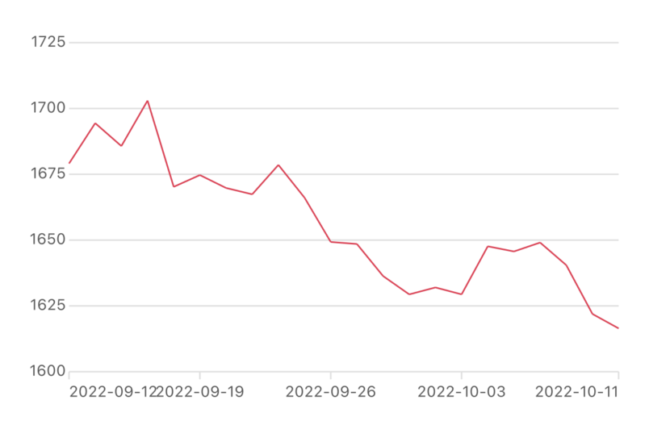
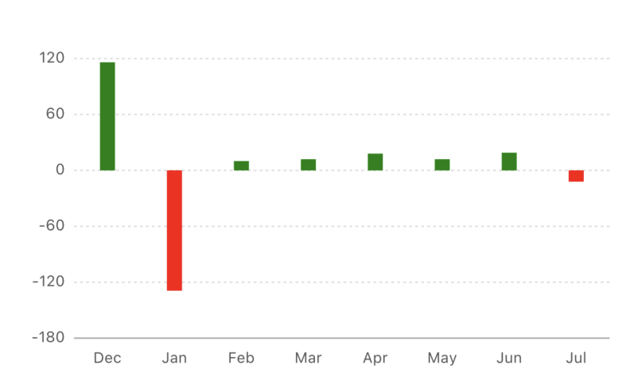
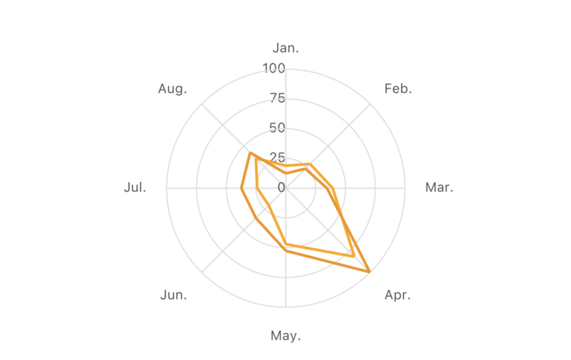

[](https://github.com/zhiyuang/react-native-statistic-charts)
=

[](https://www.npmjs.com/package/react-native-statistic-charts)
[](https://github.com/zhiyuang/react-native-statistic-charts/pulls)
[](https://github.com/zhiyuang/react-native-statistic-charts/blob/main/LICENSE)

Yet another [React Native](https://reactnative.dev/) chart library, but provide more choices of chart types and easy usage. Using [react-native-svg](https://github.com/software-mansion/react-native-svg) as the final renderer.

## Features

* 🚀 Follow the idea from "The Grammar of Graphics".
* 🎨 Support rich chart types.
* ✨ Support basic animation, tooltip and guidelines.
* 📖 Well defined APIs.


<table>
  <tr style="text-align:center;">
    <th>Geometry</th>
    <td>Point</td>
    <td colSpan="2">Line</td>
    <td>Area</td>
    <td colSpan="5">Interval</td>
  </tr>
  <tr style="text-align:center;">
    <th>Chart Type</th>
    <td>Scatter Chart</td>
    <td>Line Chart</td>
    <td>Radar Chart</td>
    <td>Area Chart</td>
    <td>Bar Chart</td>
    <td>Interval Chart</td>
    <td>Pie Chart</td>
    <td>Rose Chart</td>
    <td>Donut Chart</td>
  </tr>
  <tr style="text-align:center;">
    <th>Supported</th>
    <td>✅</td>
    <td>✅</td>
    <td>✅</td>
    <td>✅</td>
    <td>✅</td>
    <td>✅</td>
    <td>✅</td>
    <td>✅</td>
    <td>✅</td>
  </tr>
</table>

<table>
  <tr style="text-align:center;">
    <th>Chart Components</th>
    <td>Legend</td>
    <td>Tooltip</td>
    <td>GuidePoint</td>
    <td>GuideLine</td>
    <td>Text Annotation</td>
    <td>Image Annotation</td>
    <td>Range Selection</td>
    <td>Slider</td>
  </tr>
  <tr style="text-align:center;">
  </tr>
  <tr style="text-align:center;">
    <th>Supported</th>
    <td>❌</td>
    <td>✅</td>
    <td>✅</td>
    <td>✅</td>
    <td>❌</td>
    <td>❌</td>
    <td>❌</td>
    <td>❌</td>
  </tr>
</table>

## Installation

First install [react-native-svg](https://github.com/software-mansion/react-native-svg) based on [installation guide](https://github.com/software-mansion/react-native-svg#installation).

```sh
yarn add react-native-statistic-charts
```


## Quick Start
```tsx
import React from 'react'
// import chart componennt
import { Chart, Line, Axis, Tooltip } from 'react-native-statistic-charts'

// init chart data
const data = [
  {
    date: '2017-06-05',
    value: 116,
  },
  {
    date: '2017-06-06',
    value: 129,
  },
  {
    date: '2017-06-07',
    value: 135,
  },
]

export default () => (
  // render
  <Chart data={data} style={{ width: 500, height: 250, padding: [10, 20, 0, 20] }}>
    <Axis field="date" lineStyle={{ strokeColor: '#aaa' }} tickLineStyle={{ strokeColor: '#ccc' }} />
    <Axis field="value" lineStyle={{ strokeWidth: 0 }} tickLineStyle={{ strokeWidth: 0 }} grid />
    <Line position="date*value" size={2} />
    <Tooltip
      crosshair
      crosshairsType="x"
      crosshairStyle={{ strokeColor: 'orange', strokeWidth: 2, strokeStyle: 'solid' }}
      sticky
    />
  </Chart>
)
```

## Examples

### Line Chart


```tsx
import React from 'react'
import { View, Dimensions } from 'react-native'
import { Chart, Axis, Tooltip, Line, ScaleType } from 'react-native-statistic-charts'

// const data = { date: sring, value: number }[]

export default () => (
  <View>
    <Chart
      data={data}
      scale={{
        date: { type: ScaleType.TimeCategory },
        value: { type: ScaleType.Linear, tickCount: 6 },
      }}
    >
      <Axis field="date" />
      <Axis field="value" lineStyle={{ strokeWidth: 0 }} tickLineStyle={{ strokeWidth: 0 }} grid />
      <Line position="date*value" />
      <Tooltip
        crosshair
        crosshairsType="x"
        crosshairStyle={{ strokeColor: 'orange', strokeWidth: 2, strokeStyle: 'solid' }}
        sticky
      />
    </Chart>
  </View>
)
```

### Bar Chart


```tsx
import React from 'react'
import { View, Dimensions } from 'react-native'
import { Chart, Axis, Tooltip, Interval, ScaleType } from 'react-native-statistic-charts'

// const data = { date: sring, value: number }[]

export default () => (
  <View>
    <Chart
      data={data}
    >
      <Axis field="date" lineStyle={{ strokeColor: '#aaa' }} tickLineStyle={{ strokeWidth: 0 }} tickCount={8} />
      <Axis
        field="value"
        lineStyle={{ strokeWidth: 0 }}
        tickLineStyle={{ strokeWidth: 0 }}
        grid
        gridLineStyle={{ strokeStyle: 'dashed', dashedStyle: [2] }}
        labelStyle={{ offset: 6 }}
      />
      <Interval
        position="date*value"
        size={10}
        groupBy="country"
        color={{ field: 'value', value: record => (record['value'] > 0 ? 'green' : 'red') }}
      />
      <Tooltip
        crosshair
        crosshairsType="x"
        crosshairStyle={{ strokeColor: 'orange', strokeWidth: 1, strokeStyle: 'solid' }}
        sticky
        label={false}
      />
    </Chart>
  </View>
)
```

### Area Chart


```tsx
import React from 'react'
import { View, Dimensions } from 'react-native'
import { Chart, Axis, Tooltip, Area, ScaleType } from 'react-native-statistic-charts'

// const data = { date: sring, value: number }[]

export default () => (
  <Chart
    data={this.data}
    scale={{ date: { type: ScaleType.TimeCategory } }}
  >
    <Axis
      field="date"
      tickCount={3}
      lineStyle={{ strokeColor: '#aaa' }}
      tickLineStyle={{ strokeColor: '#ccc' }}
    />
    <Axis
      field="value"
      grid
      lineStyle={{ strokeWidth: 0 }}
      tickLineStyle={{ strokeWidth: 0 }}
      gridLineStyle={{ strokeStyle: 'dashed', dashedStyle: [2] }}
    />
    <Line position="date*value" color={{ value: 'orange' }} />
    <Area
      position="date*value"
      color='orange'
      style={{ fill: 'linear-gradient(90deg, orange 0%, #FFFFFF 100%)' }}
    />
    <Tooltip
      crosshair
      crosshairsType="x"
      crosshairStyle={{ strokeColor: this.state.color, strokeWidth: 1, strokeStyle: 'solid' }}
      sticky
    />
  </Chart>
)
```

### Pie/Donut Chart


```tsx
import React from 'react'
import { View, Dimensions } from 'react-native'
import { Chart, Axis, Tooltip, Interval, ScaleType } from 'react-native-statistic-charts'

// const data = { name: sring, percent: number, a: '1' }[]

export default () => (
  <Chart
    data={data}
    coord={{ transposed: true, type: 'polar', radius: 1, innerRadius: 0.55 }}
  >
    <Interval
      position="a*percent"
      adjust="stack"
      groupBy="name"
      color={{
        value: [
          '#EDA500',
          '#F97B0D',
          '#EE2C4C',
          '#BF3D39',
          '#803F62',
          '#40428A',
          '#0046AB',
          '#0079A5',
          '#26AA99',
          '#7EA84D',
        ],
      }}
      itemStyle={{ borderWidth: 3, borderColor: '#fff' }}
    />
  </Chart>
)
```

### Radar Chart


```tsx
import React from 'react'
import { View, Dimensions } from 'react-native'
import { Chart, Axis, Tooltip, Line, ScaleType } from 'react-native-statistic-charts'

// const data = { date: sring, value: number }[]

export default () => (
  <Chart
    data={this.data}
    coord={{ type: 'polar' }}
    scale={{ date: { type: ScaleType.TimeCategory, range: [0, 14 / 16] } }}
  >
    <Axis
      tickCount={8}
      field="date"
      lineStyle={{ strokeColor: '#aaa' }}
      tickLineStyle={{ strokeColor: '#ccc' }}
      labelStyle={{ offset: 10 }}
      grid
    />
    <Axis field="value" lineStyle={{ strokeColor: '#aaa' }} tickLineStyle={{ strokeColor: '#ccc' }} grid />
    <Line position="date*value" size={2} groupBy="name" />
    <Tooltip
      crosshair
      crosshairsType="x"
      crosshairStyle={{ strokeColor: 'orange', strokeWidth: 2, strokeStyle: 'solid' }}
      sticky
    />
  </Chart>
)
```

## License

MIT
